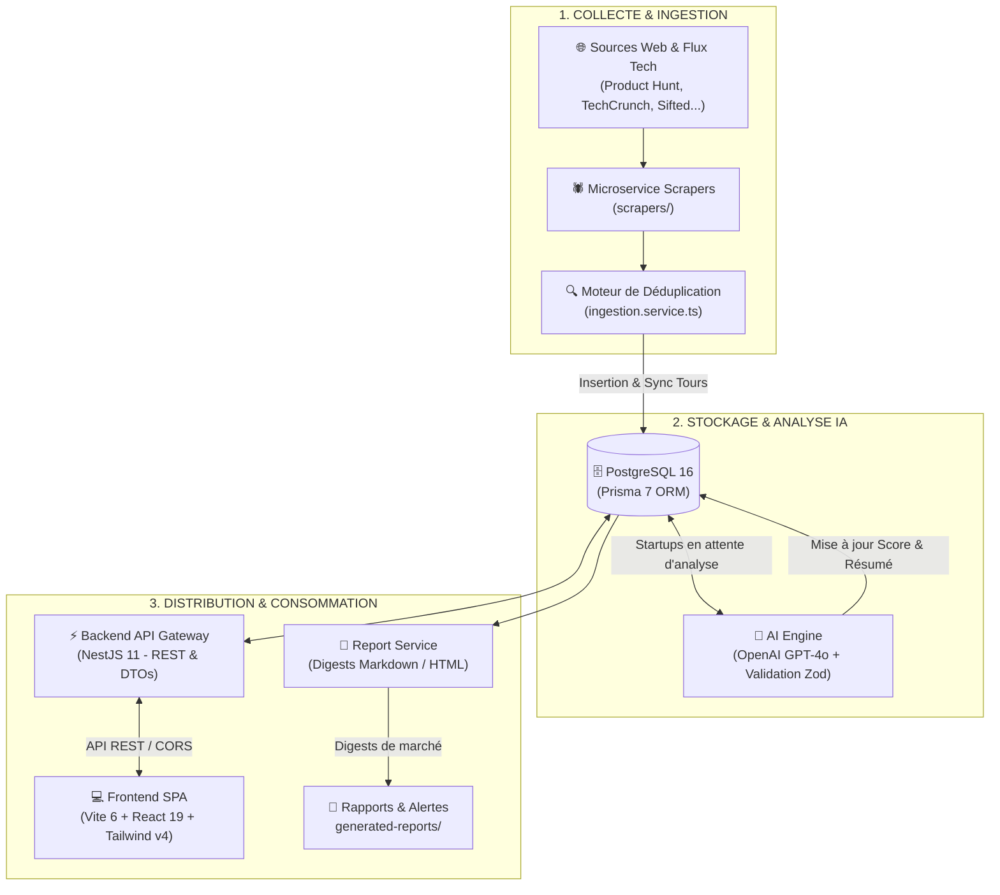

# 📡 StartupRadar — Plateforme d'Intelligence Économique & Veille IA

> **Plateforme d'intelligence d'affaires et de détection prédictive d'opportunités de croissance pour investisseurs, agences, recruteurs et cabinets de conseil.**

---

## 🎯 Propos & Vision du Projet

Dans un écosystème technologique en constante accélération, identifier les opportunités d'affaires avant la concurrence est un avantage stratégique déterminant. **StartupRadar** automatise l'intégralité du cycle de veille économique :
1. **Détection précoce** des startups innovantes, des signaux de croissance et des nouveaux tours de table.
2. **Qualification intelligente par IA** (résumé exécutif de proposition de valeur, scoring de 1 à 10, signaux de traction, risques de marché et verdict stratégique).
3. **Restitution actionnable** à travers un tableau de bord en temps réel et des rapports d'intelligence économique générés automatiquement.

### 👥 À qui s'adresse StartupRadar ?
- **Investisseurs (VCs & Business Angels)** : Détecter les pépites émergentes et suivre les levées de fonds sectorielles.
- **Recruteurs & Chasseurs de têtes** : Repérer les entreprises en phase d'hyper-croissance qui recrutent massivement.
- **Agences & Cabinets de conseil B2B** : Identifier les startups fraîchement financées ayant un besoin immédiat d'accompagnement (tech, marketing, juridique, produit).

---

## 🔄 Fonctionnement du Projet (Workflow de Données)

Le schéma ci-dessous illustre le cycle de traitement complet des données, de l'extraction sur le web jusqu'à la consultation par l'utilisateur final :



---

## ✨ Fonctionnalités Principales

### 1. 🕷️ Scraping Modulaire & Déduplication Intelligente
- Architecture extensible avec contrat d'interface [`IScraper`](file:///c:/Projects/StartupRadar/scrapers/src/interfaces/scraper.interface.ts).
- Collecte multi-sources des informations clés (nom, secteur, pays, effectifs, levées de fonds associées).
- Système anti-doublon basé sur le nom normalisé et la date des financements pour éviter toute redondance en base.

### 2. 🤖 Moteur de Scoring & Synthèse IA Multi-Fournisseurs
- Support universel de tous les fournisseurs de LLMs (**OpenAI**, **Google Gemini**, **Groq**, **DeepSeek**, **OpenRouter**, **Mistral**, ou **Ollama** en local) avec détection automatique du format de clé.
- **Healthcheck & Test de connexion au démarrage** : vérification préalable de la validité de la clé, de l'état du serveur et de la latence avant traitement.
- **Diagnostics précis d'erreurs** : identification immédiate des erreurs d'authentification (401), quotas dépassés (429) ou serveurs inaccessibles.
- **Indicateurs calculés** (validation stricte par schéma **Zod**) :
  - **Score de Potentiel (1 à 10)** : Évaluation de la viabilité et de l'attractivité.
  - **Signaux Forts** : Détection des moteurs de croissance (financement, taille d'équipe, secteur d'avenir).
  - **Risques Identifiés** : Analyse des menaces concurrentielles et des barrières à l'entrée.
  - **Verdict Actionnable** : Recommandation stratégique personnalisée pour la prise de décision.
- Mode heuristique de secours intégré pour fonctionner même hors-ligne ou sans clé API.

### 3. 📊 Tableau de Bord Interactif Temps Réel
- Interface Single Page Application (SPA) développée avec **Vite 6**, **React 19** et **Tailwind CSS v4**.
- **Cartes KPI dynamiques** : Nombre de startups actives, levées enregistrées, cibles prioritaires (score ≥ 7), score moyen.
- **Tableau filtrable** : Recherche instantanée multi-champs, filtres sectoriels, badges visuels de score et pagination complète.
- Statut de connectivité en direct à l'API backend avec bascule transparente vers le mode démo si le serveur est inaccessible.

### 4. 📑 Service de Rapports & Digests de Marché
- Microservice dédié [`report-service/`](file:///c:/Projects/StartupRadar/report-service) pour consolider les opportunités majeures.
- Génération automatique de synthèses de veille stratégique au format **Markdown** dans `generated-reports/`.

### 5. 🔒 Sécurité & Robustesse Backend
- API Gateway **NestJS 11** avec validation globale des entrées par DTOs (`class-validator`).
- Authentification par tokens **JWT** avec configuration dynamique via variables d'environnement.
- Masquage systématique des données sensibles (hashs de mots de passe) et gestion des exceptions HTTP standard.

---

## 🏛️ Architecture du Monorepo

| Microservice / Dossier | Rôle & Description | Technologies Clés |
| :--- | :--- | :--- |
| **[`frontend/`](file:///c:/Projects/StartupRadar/frontend)** | Interface utilisateur SPA réactive et moderne | Vite 6, React 19, TypeScript, Tailwind CSS v4, shadcn/ui |
| **[`backend/`](file:///c:/Projects/StartupRadar/backend)** | API Gateway REST, authentification, gestion des startups et KPI | NestJS 11, Prisma 7, PostgreSQL 16, Passport JWT |
| **[`ai-engine/`](file:///c:/Projects/StartupRadar/ai-engine)** | Analyse sémantique, extraction de signaux et scoring prédictif (Multi-Provider) | OpenAI/Gemini/Groq/Ollama, Zod, TypeScript |
| **[`scrapers/`](file:///c:/Projects/StartupRadar/scrapers)** | Extraction web distribuée, déduplication et ingestion en base | Playwright, TypeScript, PrismaPg |
| **[`report-service/`](file:///c:/Projects/StartupRadar/report-service)** | Générateur de digests exécutifs et de rapports de veille | Node.js, TypeScript, Markdown Generator |
| **[`infrastructure/`](file:///c:/Projects/StartupRadar/infrastructure)** | Déploiement conteneurisé et orchestration de production | Dockerfiles multi-stage, Docker Compose |

---

## 🚀 Démarrage Rapide

### Prérequis
* **Node.js** (v20+ recommandé)
* **Docker & Docker Compose**

### 1. Installation des dépendances
```bash
# À la racine du monorepo
npm install
```

### 2. Configuration des variables d'environnement
```bash
cp .env.example .env
```
*(Personnalisez vos clés dans `.env` : `AI_API_KEY`, `DATABASE_URL`, etc.).*

### 3. Démarrage des bases de données (Docker)
```bash
docker-compose up -d
```
*Lance PostgreSQL 16 (port 5432 avec persistance de données) et Redis 7 (port 6379).*

---

## 🛠️ Commandes Disponibles

Depuis la racine du projet, vous pouvez piloter l'ensemble des modules :

```bash
# -------------------------------------------------------------
# DÉVELOPPEMENT & APPLICATION
# -------------------------------------------------------------
npm run dev:backend       # Démarre l'API NestJS sur http://localhost:3001
npm run dev:frontend      # Démarre l'interface Vite SPA sur http://localhost:3000

# -------------------------------------------------------------
# TÂCHES DE DONNÉES & IA
# -------------------------------------------------------------
npm run test:ai           # Teste la validité de la clé API et la connectivité IA (Healthcheck)
npm run scrape            # Lance les scrapers et ingère les startups en base
npm run analyze           # Évalue par IA toutes les startups sans score
npm run generate:report   # Génère un nouveau digest de marché dans generated-reports/

# -------------------------------------------------------------
# QUALITÉ & PRODUCTION
# -------------------------------------------------------------
npm run test              # Exécute la suite de tests unitaires Jest (25 tests)
npm run build             # Compile l'ensemble des 5 modules pour la production
```

---

## 🐳 Déploiement en Conteneurs (Production)

Pour lancer la totalité de la pile en environnement isolé et conteneurisé :

```bash
docker compose -f infrastructure/docker-compose.prod.yml up --build -d
```
- **Frontend SPA (Nginx)** : accessible sur `http://localhost:3000`
- **Backend API Gateway** : accessible sur `http://localhost:3001`
- **PostgreSQL 16 & Redis 7** : configurés avec healthchecks et volumes sécurisés.
